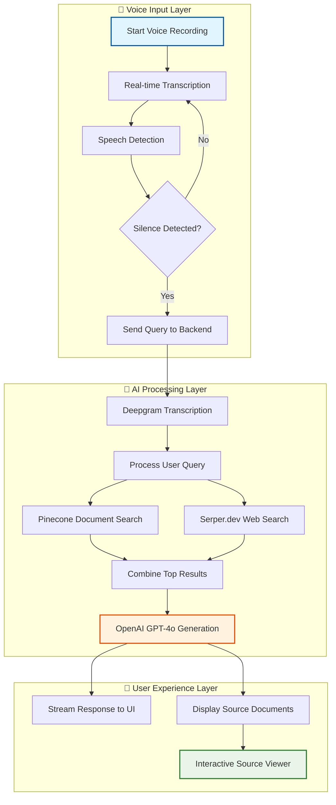

# 🎤 StealthStartup: Voice-Powered RAG System

> **Transform your documents into a conversational AI assistant that responds to your voice**

StealthStartup is an advanced Retrieval-Augmented Generation (RAG) application that enables natural voice interactions with your document library. Simply speak your questions, and get comprehensive, sourced answers powered by your uploaded documents and real-time web search.

## ✨ Key Features

### 🎯 Voice-First Experience
- **Automatic Voice Recording**: Starts recording immediately when you visit the site
- **Real-time Transcription**: See your words appear as you speak
- **Smart Query Detection**: Automatically processes your question after 3-5 seconds of silence
- **Natural Conversation Flow**: No buttons to press - just speak naturally

### 📚 Intelligent Document Processing
- **Multi-format Support**: Upload PDF documents to build your knowledge base
- **Advanced Chunking**: Intelligent text segmentation for optimal retrieval
- **Vector Search**: Semantic similarity search using Pinecone
- **Source Verification**: Every answer includes citations and page images

### 🔍 Dual-Source Intelligence
- **Document Search**: Find relevant information in your uploaded files
- **Web Search**: Augment with real-time web information
- **Combined Context**: Merges top results from both sources for comprehensive answers

### 🎨 Rich User Interface
- **Streaming Responses**: Watch answers appear in real-time
- **Interactive Source Viewer**: Zoom, pan, and download source page images
- **Document Management**: Upload, view, and delete documents easily
- **Modern Design**: Clean, responsive interface built with React and Tailwind

## 🏗️ System Architecture

```
┌─────────────────┐    ┌─────────────────┐    ┌─────────────────┐
│   Frontend      │    │   Backend       │    │   AI Services   │
│                 │    │                 │    │                 │
│ • React App     │◄──►│ • FastAPI       │◄──►│ • OpenAI GPT-4o │
│ • Voice Input   │    │ • Pinecone      │    │ • Deepgram STT  │
│ • Real-time UI  │    │ • Document Proc │    │ • Serper Search │
└─────────────────┘    └─────────────────┘    └─────────────────┘
```

## 🔄 End-to-End Workflow



## 🛠️ Technology Stack

| Component | Technology | Purpose |
|-----------|------------|---------|
| **Frontend** | React + Tailwind CSS | Modern, responsive UI |
| **Backend** | FastAPI (Python) | High-performance API server |
| **AI/ML** | OpenAI GPT-4o | Advanced language generation |
| **Speech** | Deepgram | Real-time speech-to-text |
| **Search** | Serper.dev | Web search integration |
| **Vector DB** | Pinecone | Semantic document search |
| **PDF Processing** | Unstructured.io | Intelligent document parsing |

## 📁 Project Structure

```
StealthStartup_v2/
├── backend/
│   ├── main.py                 # FastAPI application & routes
│   ├── config.py              # Environment configuration
│   ├── requirements.txt       # Python dependencies
│   └── services/
│       ├── agent_service_simple.py  # Core RAG pipeline
│       ├── vector_store.py          # Pinecone operations
│       └── pdf_processor.py         # Document processing
└── frontend/
    ├── src/
    │   ├── App.js             # Main React component
    │   ├── hooks/
    │   │   └── useVoice.js    # Voice recording logic
    │   ├── components/
    │   │   ├── ChatInterface.js     # Conversation display
    │   │   ├── SourcePanel.js       # Source document viewer
    │   │   ├── ImageViewer.js       # Interactive image viewer
    │   │   └── DocumentList.js      # Document management
    │   └── services/
    │       └── api.js         # API communication
    └── package.json           # Frontend dependencies
```

## 🚀 Quick Start

### Prerequisites
- Python 3.8+
- Node.js 16+
- API keys for OpenAI, Pinecone, Serper.dev, and Deepgram

### 1. Clone and Setup
```bash
git clone <repository-url>
cd StealthStartup_v2
```

### 2. Backend Setup
```bash
cd backend
python -m venv venv

# Activate virtual environment
# Windows:
venv\Scripts\activate
# macOS/Linux:
source venv/bin/activate

pip install -r requirements.txt
```

### 3. Frontend Setup
```bash
cd ../frontend
npm install
```

### 4. Environment Configuration
Create a `.env` file in the `backend` directory:

```env
OPENAI_API_KEY=sk-your-openai-key
PINECONE_API_KEY=your-pinecone-key
SERPER_API_KEY=your-serper-key
DEEPGRAM_API_KEY=your-deepgram-key
```

### 5. Launch the Application

**Terminal 1 - Backend:**
```bash
cd backend
uvicorn main:app --reload
```

**Terminal 2 - Frontend:**
```bash
cd frontend
npm start
```

Visit `http://localhost:3000` to start using the application!

## 🎯 How to Use

### 1. **Upload Your Documents**
- Click "Upload" to add PDF files to your knowledge base
- Documents are automatically processed and indexed for search

### 2. **Start Speaking**
- Voice recording begins automatically when the page loads
- Begin speaking your question naturally
- Watch real-time transcription appear as you speak

### 3. **Get Intelligent Answers**
- After 3-5 seconds of silence, your question is automatically processed
- The system searches both your documents and the web
- Receive a comprehensive, sourced answer in real-time

### 4. **Explore Sources**
- View source documents in the right panel
- Click on source images to open the interactive viewer
- Zoom, pan, and download source pages for verification

## 🔧 Configuration Options

### RAG Pipeline Settings
Located in `backend/services/agent_service_simple.py`:

```python
# Model Configuration
model = "gpt-4o"
temperature = 0.2

# Search Configuration
document_results = 5  # Top results from documents
web_results = 5       # Top results from web search
```

### Document Processing
Located in `backend/services/pdf_processor.py`:

```python
chunk_size = 1024      # Characters per chunk
chunk_overlap = 200    # Overlap between chunks
```

## 🤝 Contributing

We welcome contributions! Please feel free to submit issues, feature requests, or pull requests.

### Development Setup
1. Fork the repository
2. Create a feature branch
3. Make your changes
4. Add tests if applicable
5. Submit a pull request

## 📄 License

This project is licensed under the MIT License - see the LICENSE file for details.

## 🙏 Acknowledgments

- OpenAI for GPT-4o language model
- Deepgram for speech-to-text capabilities
- Pinecone for vector database services
- Serper.dev for web search integration
- Unstructured.io for document processing

---

**Ready to transform your documents into a voice-powered AI assistant? Start speaking! 🎤** 
